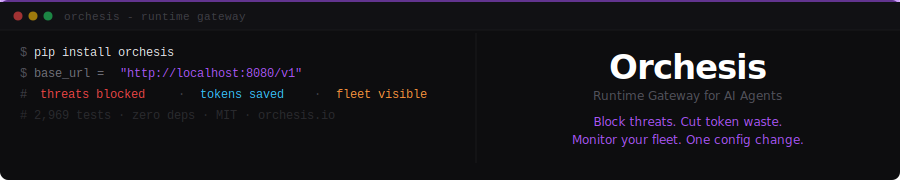
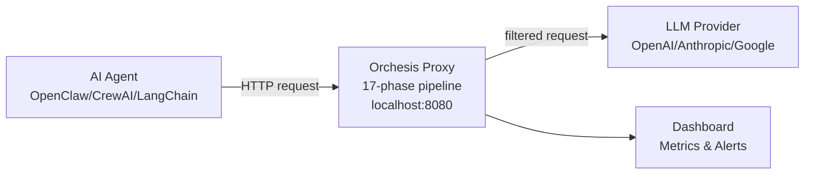

<div align="center">
  
</div>

<div align="center">

[](https://pypi.org/project/orchesis/)
[](https://github.com/poushwell/orchesis)
[](LICENSE)
[](https://github.com/poushwell/orchesis)
[](https://github.com/poushwell/orchesis)

</div>

**Orchesis** is a transparent HTTP proxy between AI agents
and LLM APIs. Every request passes through a 17-phase
detection pipeline. Zero dependencies. MIT license.
AI Agent -> [Orchesis: 17 phases] -> LLM Provider (OpenAI, Anthropic...)

<div align="center">

[](https://orchesis.io/docs)
[](https://orchesis.io/scan)
[](https://orchesis.io)

</div>

## Installation
```bash
# Core (zero dependencies)
pip install orchesis

# With integrations (Slack, Telegram, webhooks)
pip install orchesis[integrations]

orchesis quickstart --preset openclaw
```

**One line change:**
```python
# Before:
client = OpenAI(base_url="https://api.openai.com/v1")

# After:
client = OpenAI(base_url="http://localhost:8080/v1")
# ↑ 17 security phases now active
```

## How it works


## What Orchesis does

| | Security | Cost | Reliability | Observability |
|---|---|---|---|---|
| | 17-phase detection. Prompt injection, credential leaks, tool abuse. 25 signatures. | Context compression 80-90%. Semantic cache. Thompson Sampling routing. | Auto-healing. Circuit breakers. Loop detection. 6 recovery actions. | Real-time dashboard. Flow X-Ray. Agent Reliability Score. |

## By the numbers

| Metric | Value |
|--------|-------|
| Pipeline phases | 17 |
| Threat signatures | 25 across 10 categories |
| Token savings | 80-90% |
| MAST coverage | 78.6% |
| OWASP coverage | 80% |
| Auto-heal actions | 6 |
| Tests passing | 2,738 |
| Dependencies | **0** (stdlib only) |

## Free MCP Security Scanner

Check your MCP configuration for security issues:

**[→ orchesis.io/scan](https://orchesis.io/scan)**

Or via CLI:
```bash
orchesis audit-openclaw
```

---

<div align="center">

**[Website](https://orchesis.io)** ·
**[Documentation](https://orchesis.io/docs)** ·
**[MCP Scanner](https://orchesis.io/scan)** ·
**[Blog](https://orchesis.io/blog)**

MIT License · Built with ❤️ and zero dependencies

</div>

