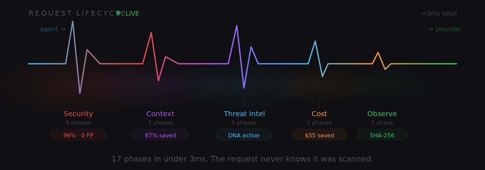

<p align="center">
  
</p>

<p align="center">
  <strong>See everything your AI agents do.</strong>
</p>

<p align="center">
  Runtime Gateway for AI Agents — block threats, cut token waste, monitor your fleet. One config change.
</p>

<p align="center">
  <a href="https://pypi.org/project/orchesis/"></a>
  <!-- UPDATE: test count on each release -->
  <a href="https://github.com/poushwell/orchesis/actions"></a>
  <a href="https://github.com/poushwell/orchesis/blob/main/LICENSE"></a>
  <a href="https://www.python.org/"></a>
  <a href="https://orchesis.ai/scan"></a>
</p>

<p align="center">
  <a href="https://orchesis.ai">Website</a> · <a href="https://github.com/poushwell/orchesis/blob/main/QUICK_START.md">Docs</a> · <a href="https://orchesis.ai/scan">MCP Scanner</a> · <a href="https://orchesis.ai/scorecard">Scorecard</a> · <a href="https://orchesis.ai/blog">Blog</a>
</p>

---

## What is Orchesis?

> Your AI agent made 122 API calls. Its built-in loop detector caught zero. Detection was ON. All thresholds configured.
> ([Issue #34574](https://github.com/OpenClaw/OpenClaw/issues/34574))

Orchesis is an open-source HTTP proxy that sits between your AI agents and their LLM providers (OpenAI, Anthropic, Google, Mistral). One config change — set `base_url` to `localhost:8080` — and every request passes through a **17-phase security pipeline**. No SDK integration. No code changes. No vendor lock-in.

- **Security** — Injection detection (96% explicit, 0 false positives), credential blocking, Crystal Alert
- **Cost** — Context compression (80-90% savings), loop detection at call #3, per-request budget enforcement
- **Reliability** — Auto-healing, cascade failure shield, 6 recovery actions, 450x faster than heartbeat checks
- **Observability** — Real-time dashboard, fleet correlation, independent audit log

Works with OpenClaw, CrewAI, LangChain, LangGraph, AutoGen, OpenAI Agents SDK, Google ADK, and any agent that speaks OpenAI-compatible API.

<details>
<summary>Supported agents and providers</summary>

**Agent frameworks:** OpenClaw, CrewAI, LangChain, LangGraph, AutoGen, OpenAI Agents SDK, Google ADK, Semantic Kernel, Haystack, any OpenAI-compatible client.

**LLM providers:** OpenAI, Anthropic, Google (Gemini), Mistral, DeepSeek, any OpenAI-compatible endpoint.

Orchesis is protocol-level (HTTP proxy), not framework-level (SDK). If your agent sends `POST /v1/chat/completions`, Orchesis works.

</details>

**Why this exists:** 390,000+ OpenClaw instances online. Malicious skills circulating in the marketplace. Budget tracking reports $0.00 for entire Codex fleets. The tools watching your agents are watching from inside the compromised context.

---

## Quickstart

### Install

```bash
pip install orchesis
```

### Use — one line change

```python
# Before:
client = OpenAI(base_url="https://api.openai.com/v1")

# After — 17 security phases now active:
client = OpenAI(base_url="http://localhost:8080/v1")
```

### Verify your setup

```bash
orchesis verify
```

### Scan MCP configs

```bash
npx orchesis-scan        # npm CLI, zero install
orchesis scan --mcp      # Python CLI
```

### Dashboard

```bash
orchesis dashboard       # opens at localhost:8081
```

---

## How it works

<p align="center">
  
</p>

<details>
<summary>Text version (accessible)</summary>

```
Agent ──► Orchesis Proxy (localhost:8080) ──► LLM Provider

Pipeline (17 phases, <3ms):
  ■ Security    1-8    injection, credentials, tool abuse, delegation
  ■ Context     9-11   compression, dedup, importance ranking
  ■ Threat      12-14  anomaly detection, fleet correlation, DNA
  ■ Cost        15-16  budget enforcement, loop detection, routing
  ■ Observe     17     audit log, dashboard, fleet intelligence

base_url = "http://localhost:8080/v1"  # one line change
```

</details>

---

## Why proxy, not SDK?

|  | SDK / callbacks | Static analysis | Generic gateway | **Orchesis proxy** |
|---|:---:|:---:|:---:|:---:|
| Sees | One agent, one session | Code at rest | Metrics and logs | **Everything, cross-agent** |
| Code changes | Required | Required | Required | **None** |
| Fleet correlation | 🔴 | 🔴 | 🟡<br><sub>partial</sub> | 🟢 |
| Real-time detection | 🟡<br><sub>partial</sub> | 🔴 | 🔴 | 🟢 |
| Formal security proofs | 🔴 | 🔴 | 🔴 | 🟢 |
| Published detection limits | 🔴 | 🔴 | 🔴 | 🟢 |
| Zero code changes | 🔴 | 🔴 | 🔴 | 🟢 |
| Open source (MIT) | 🟡<br><sub>varies</sub> | 🟡<br><sub>some</sub> | 🔴 | 🟢 |
| Self-hosted | 🔴 | 🔴 | 🔴 | 🟢 |
| No telemetry | 🔴 | 🔴 | 🔴 | 🟢 |

---

## MCP Security Scanner

Scan your MCP configs in browser or CLI. 52 checks across 6 categories: supply chain, credentials, Docker, permissions, network, cross-server.

```
$ npx orchesis-scan

  orchesis MCP Security Scanner v0.5.0

  Scanning: ~/.cursor/mcp.json
  Found 4 MCP servers

  ✗ filesystem    2 issues   [credentials: hardcoded path, permissions: write access]
  ✓ github        0 issues
  ✗ postgres      3 issues   [credentials: connection string, network: no TLS, docker: none]
  ✓ memory        0 issues

  Result: 5 issues across 2 servers
  Run `orchesis scan --fix` for remediation suggestions
```

[Try the web scanner →](https://orchesis.ai/scan)

---

## Features

### 🔒 17-Phase Security Pipeline

Adaptive detection across 8 security phases. Injection Shield (33+ signatures, 96% explicit detection, 0 false positives), Crystal Alert (behavioral anomaly), credential blocking, tool abuse detection. We publish what we can't detect: semantic injection is a proven structural limit at 0%.

### 💰 Cost Control

Context compression saves 80-90% tokens in growing-context sessions. Loop detection fires at call #3 — saves $55-150 per incident. 450x faster than heartbeat-based orchestrators. Thompson Sampling model routing. Per-request budget enforcement.

### 🔄 Auto-Healing

6 recovery strategies. Cascade Failure Shield. Model fallback. Context reset. Circuit breaker fires at call #3, not at next heartbeat.

### 📊 Dashboard

Real-time local dashboard. 8 tabs: Shield, Agents, Sessions, Flow X-Ray, Experiments, Threats, Cache, Compliance. Fleet-level correlation: which agent did what, and why it cost so much.

### 🔍 MCP Security Scanner

52 checks across 6 categories: supply chain, credentials, Docker, permissions, network, cross-server. Runs in browser or CLI.

### 🔬 Agent Autopsy

Post-incident investigation. Session replay. Decision chain reconstruction. Evidence-grade audit trail. "What killed your AI agent?" — answered.

### ✅ orchesis verify

One-command security audit of your agent setup. Checks config, connectivity, pipeline health, known vulnerabilities. First command every new user runs.

---

## By the numbers

| Metric | Value |
|---|---|
| Pipeline phases | 17 |
| Proxy overhead | < 3ms (measured) |
| Token savings | 80-90% (context compression) |
| Injection detection | 96% explicit, 0 false positives |
| Threat signatures | 33+ across 10 categories |
| MCP checks | 52 across 6 categories |
| MAST coverage | 78.6% (11/14 failure modes) |
| OWASP coverage | 80% (8/10 risks) |
| Tests passing | 4,813+ |
| Dependencies | 0 (stdlib only) |

---

## Research

Orchesis security properties are backed by formal proofs:

- **3 impossibility theorems** — what NO monitor can detect
- **1 necessity theorem + 1 capacity bound** — what ONLY a proxy can detect
- **26 formal results** total — published, peer-reviewable

Key results:

- Information loss at proxy layer is bounded (C_obs ≈ 0.57 of total agent state)
- Per-request checks don't compose: Safe + Safe ≠ Safe (k_crit = 20 for credential exfiltration)
- Pattern-based detection degrades under optimization pressure ($0.70 to evade single-parameter rules)
- Semantic injection is undetectable by any finite regex set (proven structural limit)
- One poisoned task cascades to 13 agents in 10 minutes (Cascading Injection Theorem)

We also publish what Orchesis **cannot** see: internal reasoning chains, cross-session memory, sub-process spawning, encrypted tool payloads, semantic injection (0% detection). Transparency builds trust.

📄 [Read the research →](https://orchesis.ai/blog/proxy-vs-decorator)

---

## Documentation

- [Quick Start](https://github.com/poushwell/orchesis/blob/main/QUICK_START.md) — Install and run in 60 seconds
- [Configuration Guide](https://github.com/poushwell/orchesis/blob/main/docs/CONFIG.md) — All config options
- [Pipeline Reference](https://github.com/poushwell/orchesis/blob/main/docs/PIPELINE.md) — 17 phases explained
- [Dashboard Guide](https://github.com/poushwell/orchesis/blob/main/docs/DASHBOARD.md) — Using the local dashboard
- [MCP Scanner](https://orchesis.ai/scan) — Web-based config scanner
- [Security Scorecard](https://orchesis.ai/scorecard) — Assess your stack
- [Blog](https://orchesis.ai/blog) — Articles and research

---

## Contributing

Contributions welcome! See [CONTRIBUTING.md](https://github.com/poushwell/orchesis/blob/main/CONTRIBUTING.md) for guidelines.

Priority areas:

- Injection Shield patterns (new attack categories)
- Agent framework adapters (CrewAI, Google ADK)
- Dashboard improvements
- Documentation and examples

---

## License

[MIT](https://github.com/poushwell/orchesis/blob/main/LICENSE)
