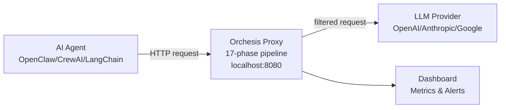

<p align="center">
  
</p>

<p align="center">
  <a href="https://pypi.org/project/orchesis/"></a>
  <a href="https://github.com/poushwell/orchesis/actions"></a>
  
  <a href="https://github.com/poushwell/orchesis"></a>
  
</p>

Orchesis is a transparent HTTP proxy for AI agents. Every request passes through
a 17-phase detection pipeline before reaching the LLM provider.
Minimal dependencies: pyyaml for configuration, optional fastapi+uvicorn for the dashboard server (pip install orchesis[server]). MIT license.

SDK sees one agent. Static analysis sees code. Observability sees metrics.
**Proxy sees everything, in real time, without code changes.**

<p align="center">
  <a href="https://orchesis.io/docs"></a>
  <a href="https://orchesis.io/scan"></a>
  <a href="https://orchesis.io/scan"></a>
  <a href="https://orchesis.io"></a>
  <a href="https://orchesis.io"></a>
</p>

## Installation
```bash
# Core
pip install orchesis

# With integrations (Slack, Telegram, webhooks)
pip install orchesis[integrations]

orchesis quickstart --preset openclaw
```

## Architecture: two services

Orchesis runs two services:
- **Proxy** (port 8080) - intercepts LLM traffic
- **API server** (port 8090) - Overwatch, agent management, budget control

Quick start:
```bash
orchesis proxy --config orchesis.yaml   # terminal 1

# Install server dependencies first
pip install orchesis[server]

# Then start the API server
orchesis serve --policy orchesis.yaml   # terminal 2 (optional)
```

**One line change:**
```python
# Before:
client = OpenAI(base_url="https://api.openai.com/v1")

# After:
client = OpenAI(base_url="http://localhost:8080/v1")
# ↑ 17 security phases now active
```

## How it works


## Why proxy, not SDK?

| Approach | What it sees | Code changes needed |
|----------|-------------|---------------------|
| SDK/callbacks (LangSmith, LangChain) | One agent, one session | Yes |
| Static analysis (Snyk, Semgrep) | Code at rest | Yes |
| Observability (Datadog, Helicone) | Metrics and logs | Yes |
| **Orchesis proxy** | **All agents, all requests, cross-session patterns** | **No** |

The proxy layer sees what SDK cannot: cross-agent patterns, fleet-level anomalies,
duplicate context across providers. This is an architectural advantage, not a feature difference.

## What's inside

**Security**
- 17-phase detection pipeline, 25+ threat signatures
- Adaptive Detection v2 (5-layer: regex -> structural -> entropy -> n-gram -> session risk)
- Intent Classifier, Response Analyzer, Tool Call Analyzer
- Memory poisoning detection, SSRF geo-classification

**Cost**
- Token Yield tracking (semantic value / total tokens)
- Cost Optimizer (5 strategies: dedup, trim, compress, prune)
- Context Compression v2 (semantic chunking, importance scoring)
- Budget advisor, cost attribution by team/project, forecasting

**Reliability**
- Auto-healing 6 levels (L1 log -> L6 circuit break)
- Agent Lifecycle Manager (state machine: active/idle/degraded/banned)
- Context Budget progressive degradation (L0/L1/L2)
- Session replay, shadow mode, pipeline debugger

**Observability**
- Real-time dashboard (dark/light theme, keyboard shortcuts, mobile responsive)
- Agent Health Score, Agent Scorecard, Agent Intelligence Profile
- Flow X-Ray timeline, Request Inspector, Session Heatmap
- Cost Analytics, Rate Limit Visualization, Notification System

**Compliance**
- EU AI Act Articles 9/12/72 - Evidence Record, Compliance Checker
- OWASP Agentic Top 10, MAST, NIST AI RMF coverage
- Policy-as-Code Validator, Compliance Report Generator
- Audit Trail Export (JSON/CSV/JSONL)

**Platform**
- Multi-tenant support, Per-team budget attribution
- Community threat intelligence (opt-in, zero PII)
- Threat Pattern Library, Signature Editor, Threat Feed
- Policy templates, migration tool, backup/restore

**Research (NLCE Layer 2+)**
- PAR Abductive Reasoning — T5 theorem implementation
- Criticality Control (H17-CC) — LQR Ψ∈[0.4,0.6]
- MRAC adaptive gain scheduling per agent
- Keystone Agent detection — trophic cascade analysis
- Carnot Efficiency — theoretical ceiling calculator
- Red Queen dynamics — adversarial co-evolution monitoring
- Kolmogorov Importance — UCI-K duality (H36)
- Context Crystallinity Ψ — gas/liquid/crystal phases
- HGT Protocol stub — horizontal gene transfer (H42)
- IACS full discourse coherence — 0.40×FC + 0.35×EC + 0.25×HC

**Viral Tools**
- Agent Autopsy - "What killed your AI agent?" one-command diagnosis
- Vibe Code Audit - AI-generated code security scanner
- ARC Certification - production readiness badge
- Weekly Intelligence Report - automated competitive briefing

## What Orchesis does

| Capability | Current coverage |
|---|---|
| Security detection | 17-phase detection pipeline, prompt injection, credential leaks, tool abuse, 25 signatures |
| Reliability controls | Auto-healing, circuit breakers, loop detection, 6 recovery actions |
| Visibility | Real-time dashboard, Flow X-Ray, Agent Reliability Score |
| Proxy overhead | 0.8% (MVE experiment, 10 iterations) |
| Context growth caught | 12x detected without proxy (MVE) |

## By the numbers

| Metric | Value |
|--------|-------|
| Pipeline phases | 17 |
| Threat signatures | 25 across 10 categories |
| MAST coverage | 78.6% |
| OWASP coverage | 80% |
| Auto-heal actions | 6 |
| Tests passing | 4,220 |
| Modules | 270 |
| Dependencies | Minimal: pyyaml (+ optional fastapi/uvicorn server) |
| Proxy overhead | 0.8% measured |
| Context collapse | 12x growth caught |
| API endpoints | 250+ |

## Free MCP Security Scanner

We scanned 900+ MCP configurations on GitHub. 75% had at least one security issue:
hardcoded credentials, overpermissioned tools, missing input validation.

Run the scanner on your own configs in 30 seconds:

**-> [orchesis.io/scan](https://orchesis.io/scan)**

Or via CLI:
```bash
npx orchesis-scan
```

52 security checks across 10 categories. No data sent to external servers.
Results in 30 seconds.

---

## Contributing
> **Note:** `dashboard/dist/` is intentionally committed for zero-setup deployment.
> Run `npm run build` in `dashboard/` to rebuild from source.

<p align="center">
  <a href="https://orchesis.io">Website</a> ·
  <a href="https://orchesis.io/docs">Documentation</a> ·
  <a href="https://orchesis.io/scan">MCP Scanner</a> ·
  <a href="https://orchesis.io/blog">Blog</a>
</p>

<p align="center">MIT License · Built with ♥ and minimal dependencies</p>

